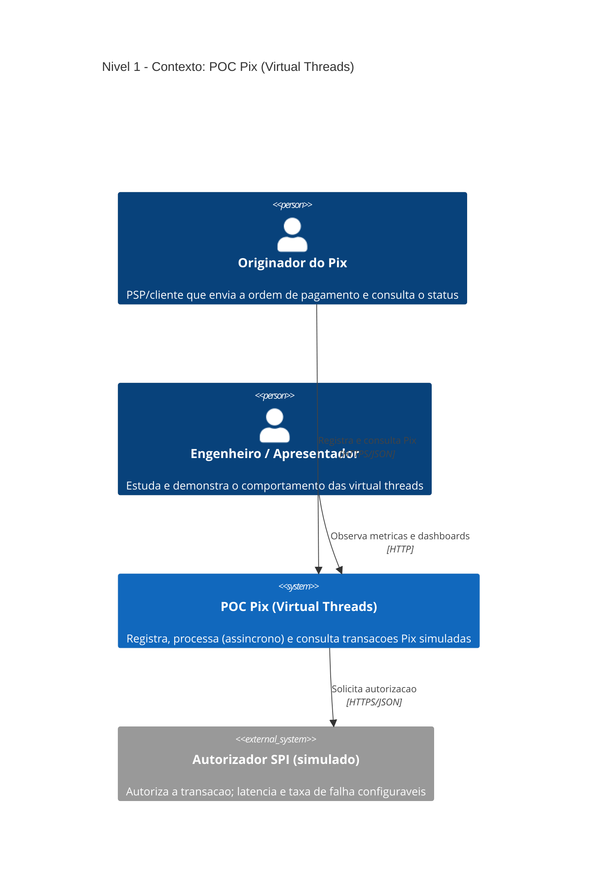
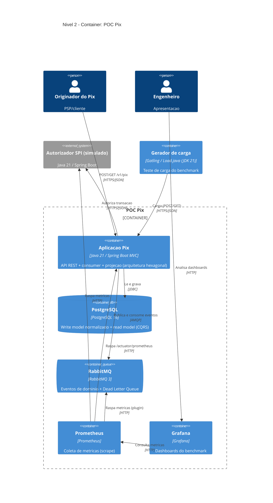
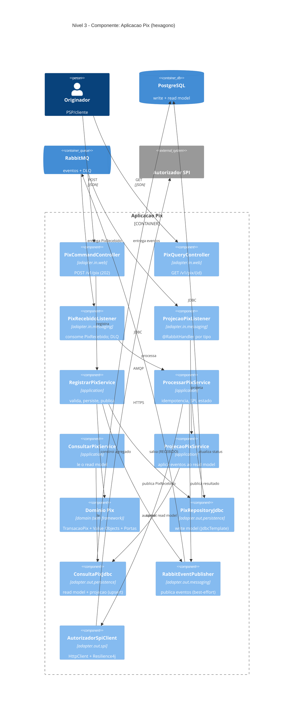

# Arquitetura — C4 Model

Diagramas no padrão [C4 Model](https://c4model.com/) (Contexto → Container → Componente),
em **Mermaid** (renderiza direto no GitHub/GitLab e na maioria das IDEs). Se o seu visualizador
não renderizar Mermaid, cole os blocos em https://mermaid.live.

> **Nível 4 (Code) é intencionalmente omitido** — como recomenda o C4, o próprio código é a fonte
> de verdade. Ver os pacotes em `src/main/java/br/com/poc/pix/` e as specs em `specs/`.

---

## Nível 1 — Contexto

Quem usa o sistema e com quais sistemas externos ele conversa.

---

## Nível 2 — Container

As unidades executáveis/deployáveis e como se comunicam. Cada uma é um serviço no `docker-compose`.

---

## Nível 3 — Componente (dentro da "Aplicação Pix")

O hexágono (Ports & Adapters). **Regra de dependência:** adapters → aplicação → domínio. O núcleo
de domínio não conhece framework (constitution P1).

---

## Legenda dos níveis C4

| Nível | Pergunta que responde | Público |
|---|---|---|
| **1 — Contexto** | Como o sistema se encaixa no mundo? Quem usa, com o que conversa? | Todos (inclusive não-técnicos) |
| **2 — Container** | Quais as peças executáveis e como se comunicam? | Time técnico / arquitetura |
| **3 — Componente** | Como cada container é organizado por dentro? | Desenvolvedores |
| 4 — Code | (omitido) O código é a fonte de verdade | — |

## Notas de arquitetura
- **Bounded Context:** `Pagamento Pix`. Agregado raiz: `TransacaoPix` (identidade = `endToEndId`).
- **CQRS-lite:** write model normalizado (`transacao_pix` + `pagador` + `recebedor`) e read model
  desnormalizado (`consulta_pix`), na mesma instância Postgres, ligados por eventos.
- **Mensageria atrás de porta:** trocar RabbitMQ por SQS = trocar adapter, sem tocar no domínio.
- **Toggles do benchmark:** HTTP (`spring.threads.virtual.enabled`) e consumer
  (`benchmark.consumer.mode`) — ver `benchmark/RELATORIO.md`.
